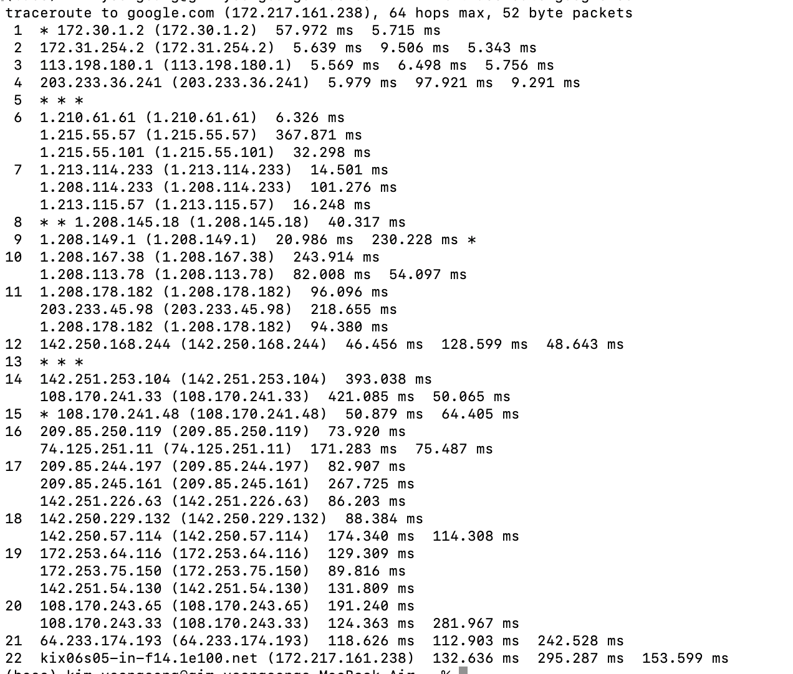
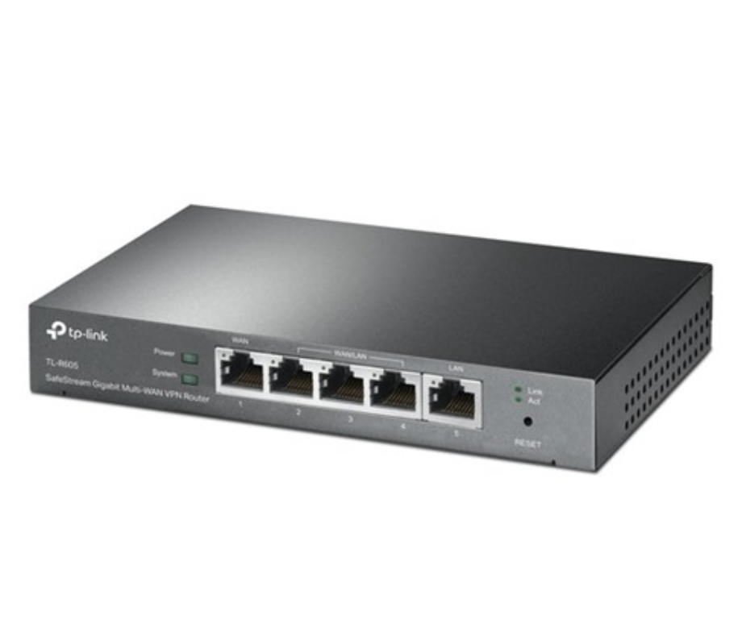
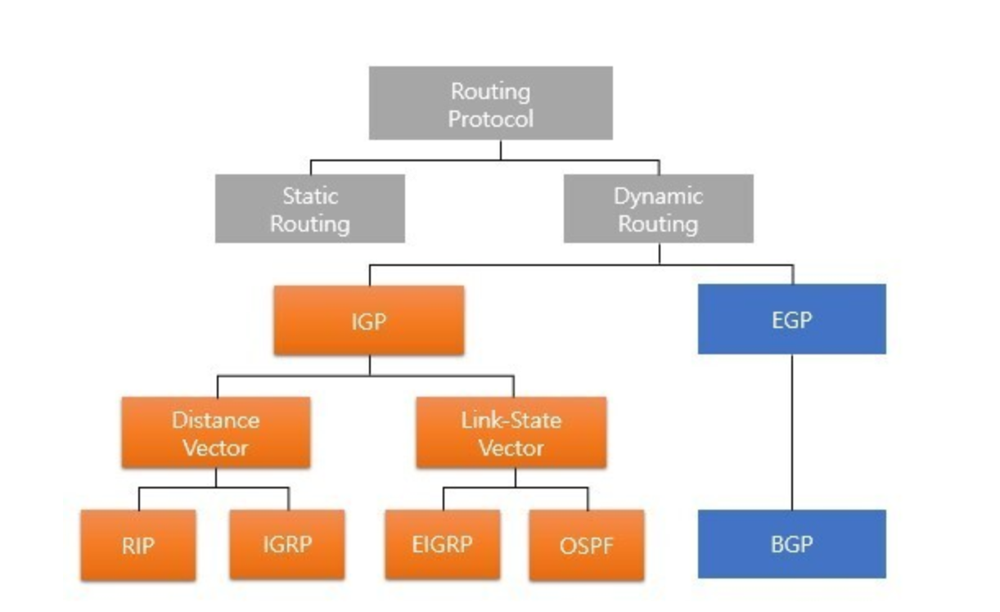
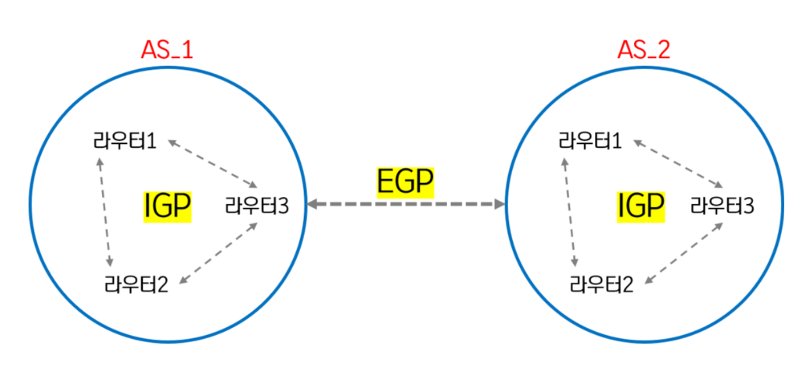
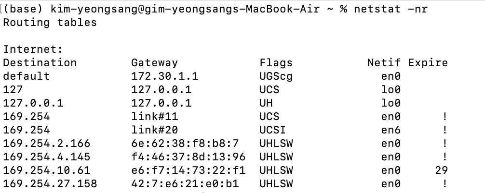
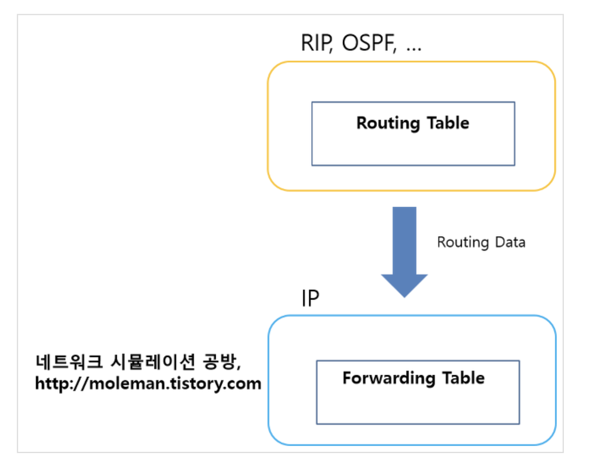

# 라우팅 && 포워딩

## 라우팅?
라우팅이란 데이터가 전달되는 과정에서 여러 네트워크들을 통과해야 하는 경우가 생길 수 있는데, 여러 네트워크들의 연결을 담당하고 있는 라우터 장비가 데이터의 목적지가 어디인지 확인하여
빠르고 정확한 길(경로)을 찾는 일련의 과정

효과  
네트워크가 정체 없이 최대한 많은 용량을 사용할 수 있도록 데이터 트래픽을 관리함으로써, 네트워크 장애를 최소화하고 네트워크 통신의 효율성을 높임

### google.com 까지 (172.217.161.238) 라우팅 과정

많은 라우터들을 거쳐서 도착하는 것을 볼 수 있음  

>*** 부분은 요청시간만료(request time out)으로서 보안상의 이유로 라우터가 ICMP패킷을 차단한 경우에 생길수 있음

#### 라우터
> 둘 이상의 패킷 전환 네트워크 또는 서브네트워크를 연결하는 장치로 네트워크 계층에서 동작

## 포워딩?
라우터나 스위치 등 네트워크 장비(하드웨어)에서 수행되는 작업으로 데이터 패킷을 라우팅된 경로를 통해 <strong>실제로 전송하는</strong> 것을 의미  
라우터로 들어온 패킷의 헤더를 검사하여 포워딩 테이블의 IP 주소와 비교하여 어디로 보내줄지를 정해주는 과정

## 라우팅과 포워딩의 차이?
라우팅은 데이터가 어디로 가야 하는지에 대한 일련의 과정을 결정하는 것이고, 포워딩은 그 결정에 따라 데이터를 실제로 전송하는 것

## 라우팅 테이블?
목적지까지 갈 수 있는 모든 가능성있는 경로들 중에서 가장 효율적이라고 판단되는 경로 정보는 패킷을 전달할 때 바로 참고해서 사용할 수 있도록 따로 모아두는데 이 공간이 라우팅 테이블(routing table)  
라우터는 이 라우팅 테이블을 사용하여 목적지 IP 주소를 분석하고 다음으로 이동할 경로를 선택 

<strong>라우팅 프로토콜(routing protocol)</strong>의 가장 중요한 목적이 바로 이 라우팅 테이블 구성

## 라우팅 프로토콜

라우팅 테이블을 생성, 유지, 업데이트, 전달하는 프토콜을 라우팅 프로토콜이라 한다.

### 정적 라우팅
관리자에 의해 Routing Table이 유지 / 관리 되는 기법  
라우팅 테이블을(라우터들 끼리) 교환하지 않고 라우팅이 가능하기 때문에 네트워크 대역폭을 절약할 수 있다. 또한 외부에 자신의 경로를 알리지 않기 때문에 보안에도 강함.  
단점으로는 경로에 문제가 생길 경우 대처하기 어려움

### 동적 라우팅
라우팅 프로토콜에 의해 자동으로 라우팅 테이블을 구성하는 기법 
자동으로 경로가 결정되는 프로토콜, 라우타가 판단하여 가장 효율적인 방법으로 패킷을 전송시키는 방법  

동적라우팅은 내부라우팅(Inner gateway protocol)과 외부라우팅(External Gateway Protocol)로 나뉨  

* 내부라우팅(Inner Gateway protocol)
같은 AS(Autonomous System)내부의 라우팅 정보를 교환하는 프로토콜

* 외부라우팅 (External Gateway Protocol)
다른 AS(Autonomous System)내부의 라우팅 정보를 교환하는 프로토콜

<storng>AS(자율시스템, Autonomous System)</strong>
> 고유한 라우팅 정책을 가지고 있는 집단(ISP(internet service provider), 정부, 회사, 단체)으로 , 네트워크의 관리범위를 계층적으로 체계화하고 라우팅 정보를 효율적으로 관리하기 위하여 도입 

### 내부라우팅

내부라우팅은 크게 2가지 라우팅 알고리즘으로 나누어짐
* 거리벡터 (Distance Vector) 기반 
* 링크 상태 라우팅 (Link state Routing)

#### 거리벡터 (Distance Vector) 기반 프로토콜

패킷이 통과하는 라우터 수, 혹은 레이턴시와 같이 트래픽에 미치는 기타 요소로 거리를 측정하여 이를 기반으로 패킷의 최적 경로를 결정함  
<strong>벨만-포드 알고리즘을 사용 </strong>  
거비벡터 기반 메트릭 정보를 <storng>인접 라우터와 주기적으로 교환</strong>해 라우팅 테이블을 구성, 갱신 

> 벨만-포드 알고리즘 - 한 노드에서 다른 노드까지의 최단 거리를 구하는 알고리즘

대표적인 예로 RIP( Routing information Protocol ) 프로토콜
* 벨만포드 알고리즘 사용
* 거리벡터 기반 메트릭 정보를 인접 라우터와 주기적으로 교환해 라우팅 테이블을 구성, 갱신 
* 기본적으로 hop count를 기반으로 경로를 선택, 최대 홉수 15 
* 30초 마다 전체 라우팅 정보를 브로드캐스팅
  * 정보 전송애 대한 부하가 매우 크기 때문에 소규모 네트워크에 적합

#### 링크 상태 라우팅(Link state routing)

링크 상태 정보를 <strong>모든 라우터에게 전달해</strong> 최단 경로 트리를 구성하는 라우팅 프로토콜 알고리즘 
네트워크에 대한 전반적인 정보를 가지고 라우터와 라우터 간 가능성 있는 <strong>모든 경로 정보를 교환</strong>
* 다익스트라 알고리즘 사용
* 대규모 네트워크에 적합

> 다익스트라 알고리즘 - 한 정점에서 다른 정점까지의 최단경로를 찾는 알고리즘

대표적인 예로 OSPF (Open Shortest Path First)  
규모가 크고 복잡한 TCP/IP 네트워크에서 RIP의 단점을 개성하기 위해 자신을 기준으로 링크 상태 알고리즘을 적용해 최단 경로를 찾는 라우팅 프로토콜
* 링크상태 라우팅 프로토콜에 기초, AS 내부 라우터들끼리 라우팅 정보를 교환한 프로토콜
* 최단경로 선택에 다익스트라 알고리즘 사용
* 네트워크를 영역 단위로 나누어 구분 관리 -> 라우팅을 효율적으로 관리

### 외부라우팅 (Exterior Gateway Protocol)
하나의 도메인(AS)에서 사용되는 IGP(Inter gateway protocol)과는 다르게 AS(Autonomous System)간의 라우팅 정보를 교환하는 것이 주목적  
대규모 네트워크의 통신을 위해 다양하고 강력한 기능을 제공하기 위해 만들어짐

BGP(Border Gateway Protocol)
* 경로 벡터 라우팅(Path vector routing)
  * 목적지 네트워크에 대해 거리가 아닌, AS간 경로(path)를 기반으로 하여 라우팅함
* BGP 에서는 하나의 AS를 하나의 홉(Hop)으로 계산 (AS 내부에 얼마나 많은 라우터들이 존재하는지는 고려x)
* 신뢰성 있는 TCP 기반의 연결을 통해 라우팅 정보 교환( BGP 라우터끼리 179 port로 전달 )

## 라우팅 테이블 구성요소

* 목적지 네트워크 주소
* 게이트웨이 
* Flag : 라우팅 항목의 상태( UGScg - Up, gateway, static connected, global,,)
* Expire(만료) : 라우팅 테이블 항목이 만료되기까지의 시간

## 포워딩 테이블 ?
### 포워딩 테이블 주요 구조 및 정보
* 목적지 IP 주소
* 출력 포트
* 넥스트 홉
* 인터페이스

라우팅 프로토콜로부터 도출된 모든 경로들이 라우팅 테이블에 저장되고, 이 루트로부터 best route 가 포워딩 테이블에 저장된다,,! 
즉 포워딩 테이블은 라우팅 테이블을 참조하여 만들어지는 테이블

ref: 
* https://www.cloudflare.com/ko-kr/learning/network-layer/what-is-a-router/
* https://velog.io/@wlsdnjs156/%EB%9D%BC%EC%9A%B0%ED%84%B0%EC%99%80-%EB%9D%BC%EC%9A%B0%ED%8C%85-%ED%85%8C%EC%9D%B4%EB%B8%94
* https://stackoverflow.com/questions/56137191/how-to-view-forwarding-and-routing-tables-in-a-linux-os-and-differences
* https://www.stevenjlee.net/2020/06/27/%EC%9D%B4%ED%95%B4%ED%95%98%EA%B8%B0-%EB%9D%BC%EC%9A%B0%ED%8C%85-%ED%94%84%EB%A1%9C%ED%86%A0%EC%BD%9C-bgp/