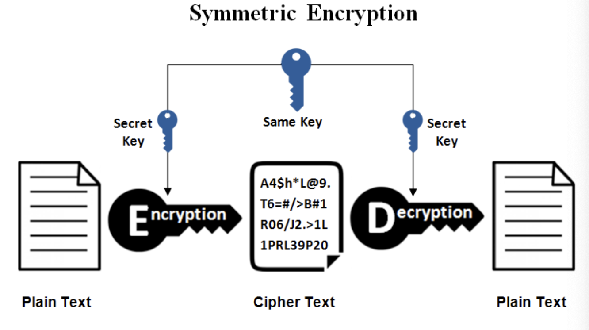
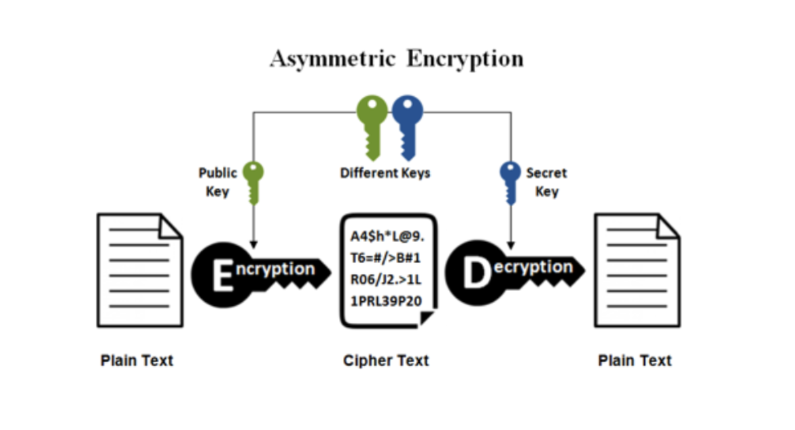
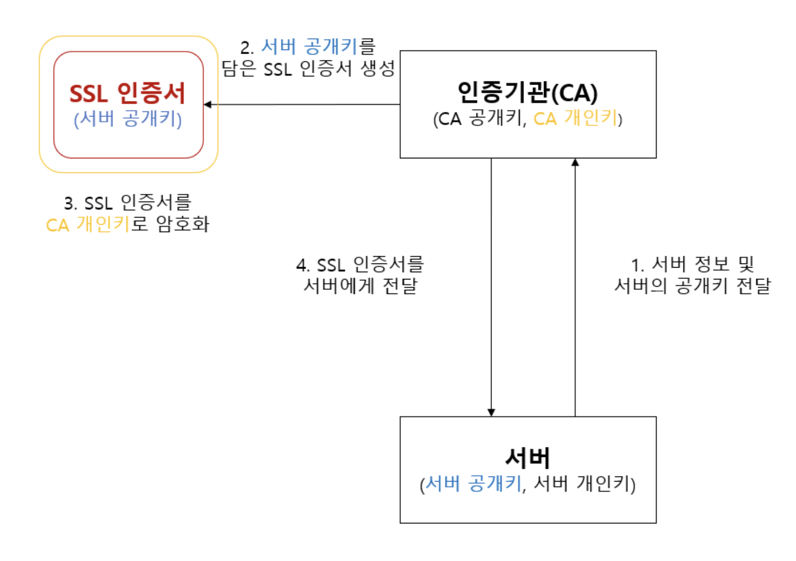
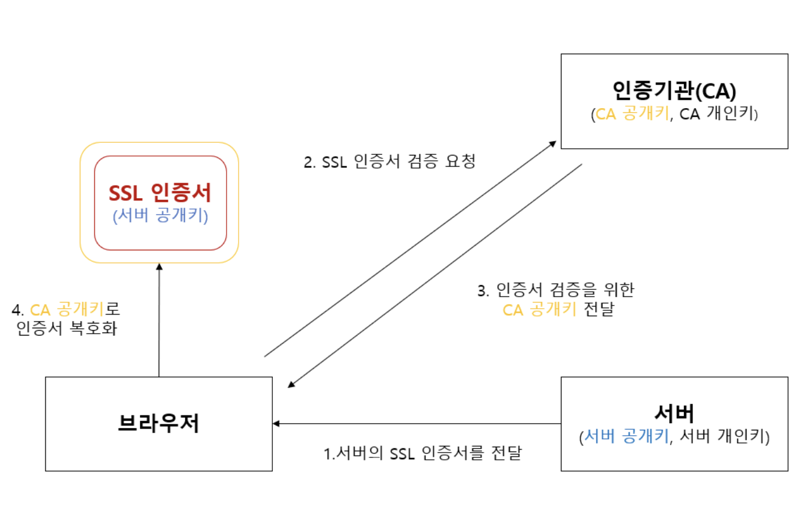
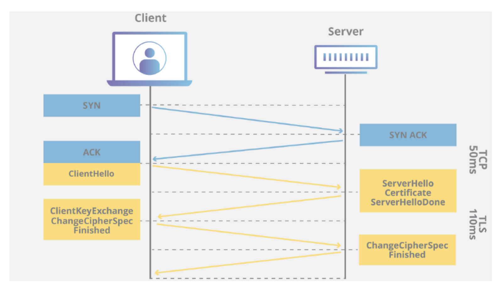

# HTTP ?

## HTTP
HTTP(HyperText Transfer Protocol)이란 웹 서버와 웹 클라이언트 사이에 데이터를 주고 받기 위해 사용하는 <storng>통신 규약</strong>이다

## HTTPS

HTTPS(HyperText Transfer Protocol over Secure socket layer )의 약자로 HTTP에서 보안이 강화된 버전으서
별개의 프로토콜이 아닌 SSL/TLS을 사용해 암호화하여 보안 통신을 제공하는 HTTP의 확장된 버전   

⚠️HTTP는 암호화 되지 않은 방법으로 데이터를 전송하기 떄문에 서버와 클라이언트 사이의 메시지를 감청당할 수 있음

역할
* 암호화를 통해 클라이언트가 정보를 서버와 안전하게 주고받고록 해준다. 즉 제 3가자 클라이언트가 서버에 보내는 정보들을 못보게 하는 역할
* 접속한 사이트가 신뢰할만한 사이트인지 알려주는 역할
* 통신 내용의 악의적인 변경을 방지

## 공개키와 대칭키에 대해 설명해주세요

### 대칭키
암호화, 복호화에 같은 암호키(대칭)를 사용하는 기법으로, 암/복호화키가 동일하므로 해당 키를 아는 사람이 문서를 복호화 할 수 있음.
암호화에 사용되는 대표적인 알고리즘으로는 DES, 3DES, AES 등이 있다.

#### 대칭키 암호화 방식 진행 과정

어떤 키로 암호화 했다면, 수신자도 같은 키가 있어야 복호화가 가능

장점
* 암호화 방식에 속도가 빠름
* 구현 간단

단점
* 송신자 수신가 간에 동일한 키를 공유해야 하므로 많은 사람들과의 정보 교환 시 많은 키를 관리해야 하는 어려움이 있음
* 탈취 걱정이 존재함
* 관리해야 할 암-복호화 키가 많음, N명 -> N(N-1) / 2

주 용도
* 고용량 데이터 암호화

### 공개키(비대칭키)
암호화시 사용하는 키와 복호화시 사용하는 키가 다른기법으로, 2개의 키 (공개키, 비밀키)가 존재.  
A, B 두개의 키가 있을때 A키를 사용해 암호화를 하면 B키로 복호화할 수 있고  
B키로 암호화를 하면 A키로 복호화를 할 수 있음  
대표적인 암호화 알고리즘으로는 RSA, DSA, ECC 등이 있음.

대칭키의 키 분배 문제 (대칭키일 때는 송수신자 간만 키를 알아야 하기 때문에 분배가 복잡하고 어렵지만 공개키와 비밀키로 분리할 경우, 남들이 알아도 되는 공개키만 공개하면 되므로)를 해결할 수 있음
#### 공개키 암호화 방식 진행 과정

1. A가 웹 상에 공개된 B의 공개키를 이용해 평문을 암호화하여 B에게 보냄
2. B는 자신의 비밀키로 복호화한 평문을 확인, A의 공개키로 응답을 암호화하여 A에게 보냄
3. A는 자신의 비밀키로 암호화된 응답문을 복호화함

클라이언트(A)가 비밀번호를 서버(B)에 전송하는 과정  
서버(B)이 공개키는 웹상에 open 되어 있고 비밀키는 서버(b)가지고 있다고 있음  
1. 클라이언트(A)가 비밀번호(정보)를 서버(B)의 공개키로 암호화 하여 서버(B)에게 전송  
2. 서버(B)는 가지고 있는 개인키로 비밀번호(정보)를 복호화

이과정에서 공개키가 유출이 된다해도 공개키로는 암호화만 가능하고 <strong>복호화는 비밀키</strong>로만 가능하기 때문에 정보는 안전하다고 할수 있음.

장점
* 키를 분배해야할 필요성이 없음
* 기밀성/인증/부인방지 기능 제공 (인증, 전자서명 간단)

단점
* 키 길이가 길기 때문에 암호화 - 복호화 속도가 느림

주용도
* 키 교환 및 분배, 인증

방식

## 왜 HTTPS handshake 과정에서는 인증서를 사용하는 것 알까요?

### SSL(Secure socket layer) ? 
SSL(Secure Sockets Layer)은 암호화 기반 인터넷 보안 <strong>프로토콜</strong>  
웹 서버 사이를 이동하는 모든 데이터를 암호화하고, 정보가 도난당하는 것을 막아

### SSL 인증서
SSL은 SSL 인증서가 있는 웹사이트만 실행 가능, SSL 인증서는 사람의 신원을 확인하는 신분증이나 배지와 같음,  
즉 클라이언트가 접속한 서버가 신뢰할 수 있는 서버임을 보장함  
SSL 인증서 발행을 담당하는 기업(기관)을 CA(Certificate authority)라고 부름

### SSL 동작방식 (HTTPS의 통신 과정) 
이 SSL은 위에서 언급한 공개키와 대칭키를 혼합해서 사용함!  
실제 데이터는 대칭키를 사용하여 암호화, 복호화 되고, 이때 사용되는 대칭키의 공유를 위한 암호화 기법으로 공개키를 사용
-> 컴퓨팅 파워를 덜 소모하는 성능적인 이점과 보안적 관점의 이점을 동시에 가져갈 수 있음.

HTTPS 동작과정은 1. 인증 2. 협상 (handshake)의 과정으로 이루어짐

#### 1.인증

인증서 발급

1. 서버는 공개키와 개인키를 생성하여 자신에 대한 정보와 함께 공개키를 인증기관(CA)에 전달
2. CA는 전달 받은 정보를 바탕으로 서버의 공개키를 담은 SSL 인증서를 생성
3. SSL 인증서를 CA(인증기관)의 개인키로 암호화 -> CA에서 발급한 인증서라는 것을 증명할 수 있음 
4. 암호화된 SSL 인증서를 서버에 전달하고, 서버는 이를 보관함

인증서 검증

1. 브라우저가 서버와 연결을 요청하면, 서버는 자신의 SSL 인증서를 브라우저에게 전달   이떄 SSL handshake 과정을 통해 브라우저에게 전달됨
2. 브라우저는  CA(인증기관)에게 검증 요청
3. CA는 자신의 공개키를 브라우저에게 전달
4. 브라우저는 CA의 공개키로 SSL 인증서를 복호화, 복호화가 성공할시 서버의 공개키를 확보함.

#### 2.협상 (handshake)

신뢰할 수 있는 서버임이 인증되었다면, 서버와 브라우저와 어떤 알고리즘과 <strong>대칭키</strong>로 데이터를 암호화하여 주고 받을지  
협상이 필요함. 이 과정은 TCP 연결이 수립된 후, SSL/TLS 프로토콜에서 SSL handshake를 통해 결정됨

1. client hello : client가 srver에 연결을 시도하며 전송하는 패킷, 자신이 사용가능한 알고리즘 목록을 서버에 전송
2. server hello : 클라이언트가 가능한 알고리즘중 하나를 선택한다음 client에게 전송함
3. Certificate : server가 자신의 SSL인증서를 client에게 전달. SSL 인증서 내부에 있는 server의 공개키는 CA의 개인키로 암호화되었으므로 공개된 CA의 공개키로 복호화
4. (optional) server key exchage : server의 공개키가 SSL인증서 내부에 없는 경우 server가 직접 전달함을 의미 (공개키가 SSL 인증서 내부에 있을 경우 server key exchange 는 생랴됨)
5. server hello done : 서버의 작업이 종료됨
6. client key exchange : <strong>대칭키</strong>를 client가 생성하여 SSL 인증서 내부에서 추출한 server의 공개키로 암호화 한후 server에게 전달   --> 이때 클라이언트가 생성한 대칭키가 SSL Handshake의 목적이자 가장 중요한 수단인 데이터를 실제로 암호화할 대칭키(비밀키)!
7. ChangeCipherSpec : Client, server 모두가 서로에게 보내는 패킷으로 교환할 정보를 모두 교환한 뒤 통신할 준비가 되었음을 알리는 패킷
8. Finished : SSL Handshake 종료

## SSL와 TLS의 차이는 무엇인가요?
SSL은 1996년 SSL 3.0이후 업데이트되지 않음  
TLS는 SSL의 업데이트 버전으로 이름이 바뀐 이유는 NetScape가 업데이트에 참여하지 않게 되어 소유권 변경을 위해서 변경함  
SSL은 TLS(Transport Layer Security) 암호화의 전신으로 현재 TLS 인증서가 업계 표준이나, TLS인증서를 지칭하는데 SSL이라는 용어를 계속 사용함  
#### 변경점
SSL handshake는 명시적연결이나 TLS handshake는 암시적연결이며, TLS는 SSL handshake보다 프로세스 단계가 적음

ref:
https://velog.io/@dong5854/HTTPS%EC%99%80-SSL%EC%9D%B8%EC%A6%9D%EC%84%9C-%EB%8C%80%EC%B9%AD%ED%82%A4-%EA%B3%B5%EA%B0%9C%ED%82%A4%EB%B9%84%EB%8C%80%EC%B9%AD%ED%82%A4
https://gyoogle.dev/blog/computer-science/network/%EB%8C%80%EC%B9%AD%ED%82%A4%20&%20%EA%B3%B5%EA%B0%9C%ED%82%A4.html
https://velog.io/@ann0905/HTTPS-2.-HTTPS%EC%99%80-SSL-Handshake
https://opentutorials.org/course/228/4894
https://aws-hyoh.tistory.com/entry/HTTPS-%ED%86%B5%EC%8B%A0%EA%B3%BC%EC%A0%95-%EC%89%BD%EA%B2%8C-%EC%9D%B4%ED%95%B4%ED%95%98%EA%B8%B0-3SSL-Handshake
https://aws-hyoh.tistory.com/entry/HTTPS-%ED%86%B5%EC%8B%A0%EA%B3%BC%EC%A0%95-%EC%89%BD%EA%B2%8C-%EC%9D%B4%ED%95%B4%ED%95%98%EA%B8%B0-3SSL-Handshake